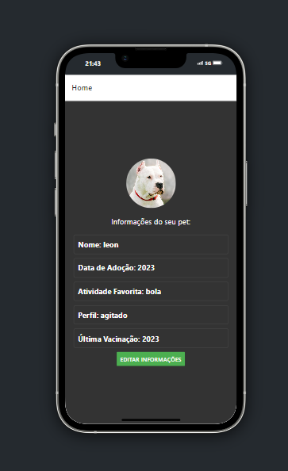

## Descrição do Projeto

O **VegPet** é um projeto desenvolvido para ajudar donos de pets a gerenciar as vacinas de seus animais de estimação. Além da funcionalidade atual de controle de vacinas, o projeto tem planos futuros de adicionar recursos como agendamento de consultas veterinárias e localizações de pet shops próximos.



## Estrutura do Projeto

my-app/ │ ├── front-end/ │ └── (Código fonte do front-end em React Native com Expo) │ └── back-end/ └── (Código fonte do back-end em Node.js)

## Pré-Requisitos

Antes de começar, certifique-se de ter as seguintes ferramentas instaladas:

- **Node.js**: [Baixar e instalar Node.js](https://nodejs.org/)
- **npm** ou **Yarn**: Gerenciador de pacotes Node.js (instalado automaticamente com o Node.js)
- **Expo CLI**: [Instalar Expo CLI](https://docs.expo.dev/get-started/installation/)
- **Git**: [Baixar e instalar Git](https://git-scm.com/)
- **SQLite**: [Baixar e instalar SQLite](https://www.sqlite.org/download.html)

### Clonar o Repositório

Clone o repositório para sua máquina e navegue até o diretório do projeto:

```bash
git clone https://github.com/Carolemk/my-app

```

### Após clonar iniciar o projeto

```
cd my-app
```

#### Iniciando o Front end

```
npx expo start
```

#### Iniciando o Back End

Em outro terminal abra o Back end

```
cd backend

npm start
```
